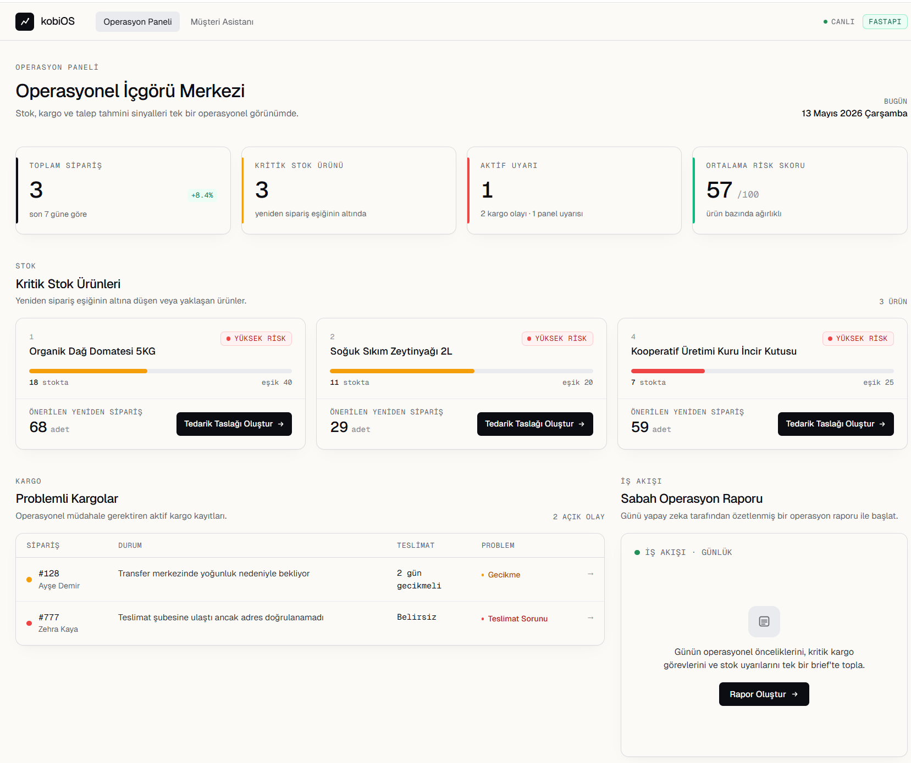
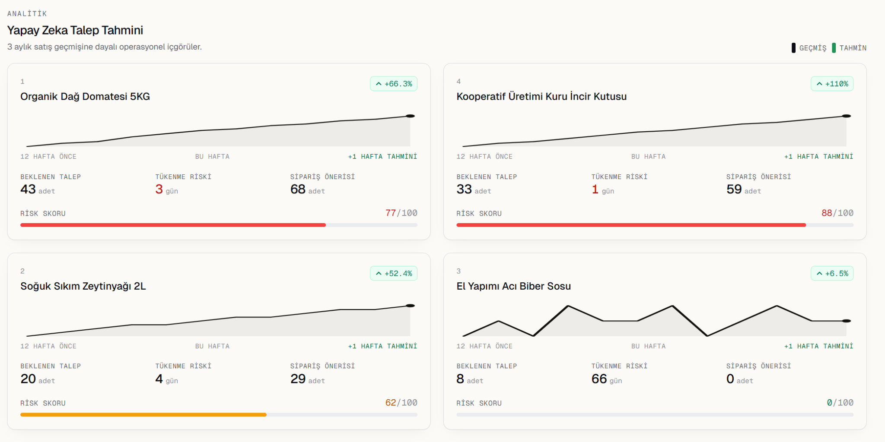
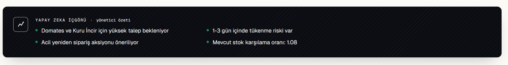
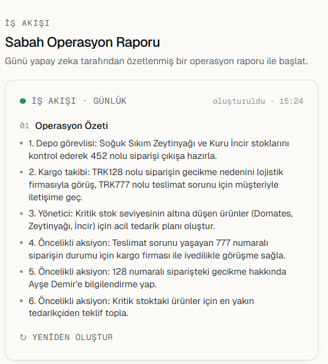
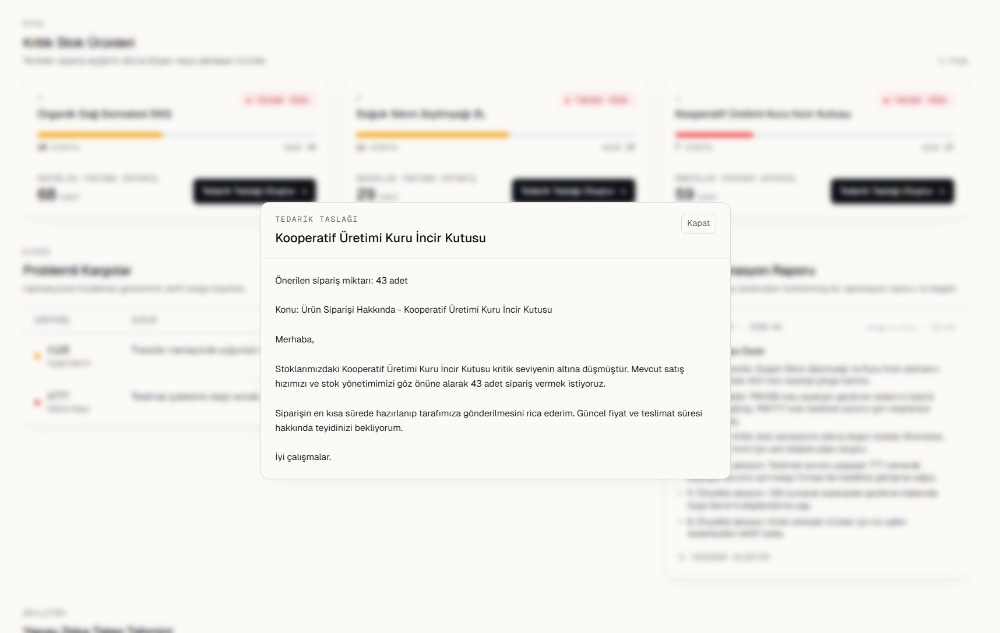
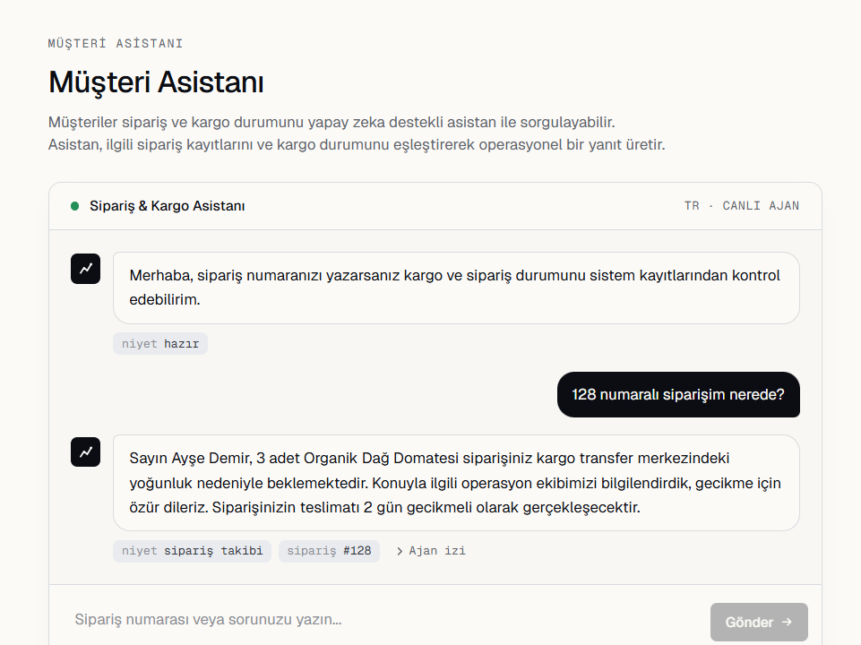

# KobiOS

Yapay zeka destekli KOBİ operasyon yönetim platformu.

KobiOS; müşteri iletişimi, stok takibi, kargo yönetimi ve operasyon süreçlerini yapay zeka destekli şekilde yöneten modern bir operasyon sistemi prototipidir.

Proje, YZTA AI Hackathon kapsamında geliştirilmiştir.

---

# Problem

KOBİ’ler ve kooperatifler operasyon süreçlerini çoğunlukla manuel yöntemlerle yönetmektedir.

Bu durum:

- müşteri destek yükü,
- geciken kargolar,
- kritik stok problemleri,
- operasyonel verimsizlik,
- ölçeklenme sorunları

oluşturmaktadır.

KobiOS bu süreçleri tek bir AI destekli operasyon katmanında birleştirir.

---

# Özellikler

## AI Müşteri Asistanı

Müşteriler doğal dil ile sipariş ve kargo durumu sorgulayabilir.

Örnek:

> “128 numaralı siparişim nerede?”

---

## Operasyon Dashboardu

Yöneticiler için:

- sipariş görünürlüğü
- kritik stok takibi
- problemli kargolar
- operasyonel uyarılar

tek ekranda sunulur.

---

## Kargo Yönetimi

- geciken kargo tespiti
- teslimat problemi takibi
- operasyonel kargo görünürlüğü

---

## Stok ve Envanter Yönetimi

- kritik stok tespiti
- risk analizi
- yeniden sipariş önerileri

---

## Tedarikçi Taslak Oluşturma

Sistem kritik ürünler için otomatik tedarikçi taslağı oluşturabilir.

---

## AI Talep Tahmini

KobiOS geçmiş satış verilerini analiz ederek:

- haftalık talep tahmini,
- stok tükenme riski,
- operasyonel risk skoru

üretir.

---

## Sabah Operasyon Raporu

Yapay zeka destekli günlük operasyon özeti üretir.

---

# Teknoloji Yığını

## Frontend

- React
- Vite
- TailwindCSS

## Backend

- FastAPI
- Python
- SQLModel
- SQLite

## AI Katmanı

- Gemini API

---

# Sistem Akışı

```text
Müşteri Sorusu
      ↓
FastAPI Backend
      ↓
Operasyon Servisleri
      ↓
Sipariş / Kargo / Forecast Mantığı
      ↓
Gemini AI Katmanı
      ↓
Operasyonel Yanıt
```

---

# API Endpointleri

| Endpoint | Açıklama |
|---|---|
| POST /chat | AI müşteri asistanı |
| GET /dashboard | Operasyon dashboard verisi |
| GET /cargo/delays | Problemli kargolar |
| GET /orders | Sipariş listesi |
| GET /analytics/forecast | Talep tahmini ve AI insight |
| GET /workflow/morning-report | Sabah operasyon raporu |
| POST /supplier/draft/{id} | Tedarikçi taslağı oluşturma |

---

# Ekran Görüntüleri

## Operasyon Dashboardu



KobiOS operasyon merkezi; kritik stoklar, aktif uyarılar, problemli kargolar ve operasyonel sinyalleri tek panelde toplar.

---

## AI Talep Tahmini



Geçmiş satış verileri analiz edilerek haftalık talep tahmini, stok tükenme riski ve yeniden sipariş önerileri oluşturulur.

---

## AI Operasyon İçgörüsü



Yapay zeka; operasyonel riskleri analiz ederek yöneticilere aksiyon alınabilir özetler üretir.

---

## Sabah Operasyon Raporu



Günlük operasyon akışı için öncelikli görevler ve kritik süreçler otomatik olarak özetlenir.

---

## Tedarikçi Taslağı



Kritik stok seviyesine düşen ürünler için otomatik tedarik talep taslağı oluşturulur.

---

## Müşteri Asistanı



Müşteriler doğal dil ile sipariş ve kargo durumlarını sorgulayabilir.

---

# Kurulum

## Backend

```bash
cd backend
python -m venv venv
venv\Scripts\activate
pip install -r requirements.txt
python -m uvicorn app.main:app --reload
```

Backend:

```text
http://127.0.0.1:8000
```

---

## Frontend

```bash
npm install
npm run dev
```

Frontend:

```text
http://127.0.0.1:5173
```

---

# Teknik Güçlü Yönler

- Modüler FastAPI mimarisi
- AI destekli operasyon iş akışları
- Forecasting katmanı
- Operasyonel dashboard yapısı
- Yapay zeka destekli insight üretimi
- Responsive frontend
- Lazy-loaded AI bölümleri

---

# Gelecek Geliştirmeler

- ERP entegrasyonları
- gerçek kargo API bağlantıları
- gelişmiş ML forecasting modelleri
- authentication sistemi
- cloud deployment

---

# Lisans

MIT License

